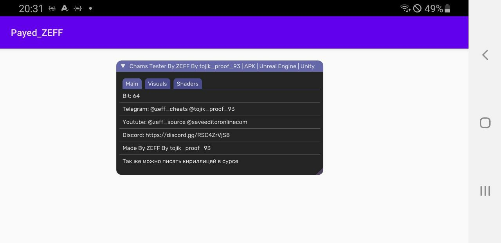

# Payed_ZEFF
[](https://github.com/FlutterGenerator/Payed_ZEFF/actions/workflows/build-apk.yml)

[](https://github.com/FlutterGenerator/Payed_ZEFF/blob/master/LICENSE)



## Билд через AIDE

* 1) Вшиваем либку
* 2) Вшиваем дексы
* 3) В активити игры в функцию onCreate вставляем:

# Add To Main Activity OnCreate

```
invoke-static {p0}, Lcom/mycompany/application/MainActivity;->Start(Landroid/content/Context;)V
```

* TG: @zeff_cheats

# Main Activity is Same for all unity games :
```
com / unity3d / player / unitPlayerActivity
```
